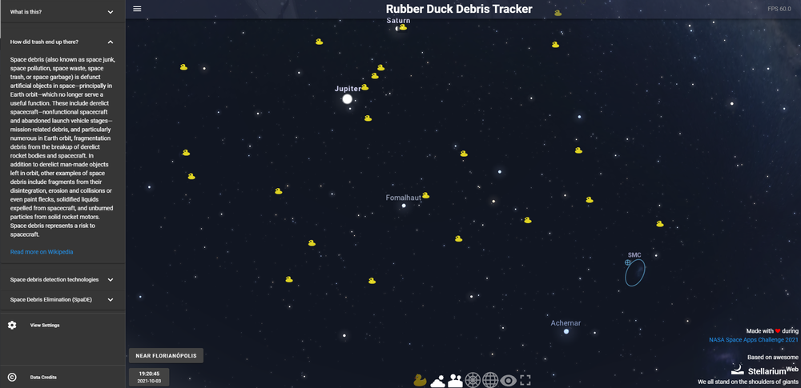

Rubber Duck Debris Tracker
=====================

Our project goal is to raise awareness about space debris.

Contrary to popular beliefs, space around Earth is far from empty.

Our project’s goal is to counter the “out of sight, out of mind” careless approach of the public towards the issue of space debris. In order to make it memorable, entertaining and funny, we decided to show space debris from an Earthling’s perspective but with a twist: we have marked known space debris as rubber ducks. 

You can see it in action here:

https://theduckening.space/

